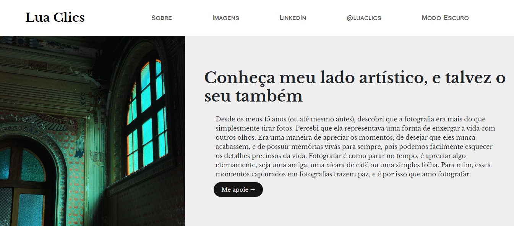

# Portfólio Lua Clics

>Explorando programação nesse projeto, combinando-a com fotografia. Compartilho meu mundo, desenvolvendo habilidades em programação e expondo meu amor pela fotografia.

### Ajustes e melhorias

O projeto ainda está em desenvolvimento e as próximas atualizações serão voltadas nas seguintes tarefas:

- [ ] Alterar a cor do ícone do navbar toggler quando está em modo escuro para dispositivos móveis;
- [ ] Melhorar espaçamento de imagens para dispositivos móveis;
- [ ] Buscar o motivo da margem direita ao longo da página para dispositivos móveis;

 
 

## ☕ Acessando o portfólio

Para acessar o portfólio Lua Clics, siga estas etapas:

Aqui no GitHub, dentro do repositório, na lateral superior direita, você encontra a aba "Sobre". Nela, você encontra o link que direciona direto para o site.

 
 

## 📫 Contribuindo para <nome_do_projeto>

Para contribuir com <nome_do_projeto>, siga estas etapas:

1. Bifurque este repositório.
2. Crie um branch: `git checkout -b <nome_branch>`.
3. Faça suas alterações e confirme-as: `git commit -m '<mensagem_commit>'`
4. Envie para o branch original: `git push origin <nome_do_projeto> / <local>`
5. Crie a solicitação de pull.

Como alternativa, consulte a documentação do GitHub em [como criar uma solicitação pull](https://help.github.com/en/github/collaborating-with-issues-and-pull-requests/creating-a-pull-request).

 
 

## 😄 Seja um dos contribuidores

Quer fazer parte desse projeto? <a href="https://mail.google.com/mail/?view=cm&to=faculdadeluana24@gmail.com&body=Ol%C3%A1%2C%20estou%20entrando%20em%20contato%20sobre..." target="_blank">Me envie um e-mail!</a>

 
 

## 📝 Licença

Esse projeto está sob licença. Veja o arquivo [LICENÇA](LICENSE.md) para mais detalhes.
